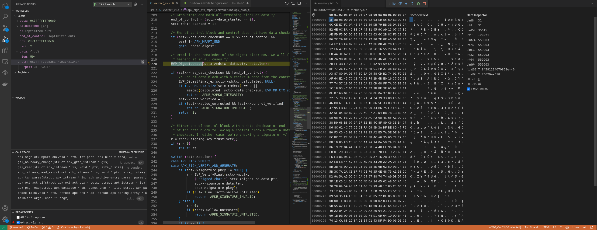

## Motiviations for this fork

This fork was setup to answer the following questions:

* How are apk package checksums calculated in the APK INDEX ? 

https://stackoverflow.com/questions/38837679/alpine-apk-package-repositories-how-are-the-checksums-calculated

* How is the APKINDEX format ? 

* How is the .PKGINFO format ? 

* How do you implement the apk index command in another implementation ? 

# Alpine Package Keeper

We ask the following questions....

* What is the format of an Alpine Repository index file ? 

We start our investigation by downloading such a file from a public repository:

```bash
> wget http://nginx.org/packages/alpine/v3.13/main/x86_64/APKINDEX.tar.gz 
> ls -lt APKINDEX.tar.gz
-rw-rw-r-- 1 user user 5352 dec  1 16:55 APKINDEX.tar.gz
```

The file utility confirms this...

```bash
> file APKINDEX.tar.gz
APKINDEX.tar.gz: gzip compressed data, max compression, from Unix, original size modulo 2^32 33792

```

We also use the tar program to verify that its a gzip compress tar archive,

```bash
> tar tvf APKINDEX.tar.gz 
-rw-rw-r-- builder/builder 256 2022-11-17 13:36 .SIGN.RSA.nginx_signing.rsa.pub
-rw-r--r-- root/root        16 2022-11-17 13:36 DESCRIPTION
-rw-r--r-- root/root     31176 2022-11-17 13:36 APKINDEX
```

So the APKINDEX file is consists of 3 files, a public signature, a description file and the index file.

But what exactly is a gzip file ? What format does it have ? 
According to wikipedia (https://en.wikipedia.org/wiki/Gzip), a gzip file consists of a sequence
of bytes organized into member sections (headers, compressed data etc.) 
A gzip file always start with a magic number, a sequence of 4 bytes, 0x1f 0x8b.

So if APKINDEX.tar.gz is a proper gzip file it must start with 1 magic number (2 bytes), of 0x1f 0x8b in hexdecimal.

We can check this using the xxd command,

```bash
>  xxd APKINDEX.tar.gz|grep 1f8b
00000000: <1f8b> 0800 0000 0000 0203 d30b f674 f7d3  .............t..
00000180: 9c90 8694 0004 0000 <1f8b> 0800 0000 0000  ................
```

or using grep

```bash
> LANG=C grep -obUaP '\x1f\x8b' APKINDEX.tar.gz
0:
392:
```

We get the offsets to each gzip part.

We now notice two distinct magic numbers. We then conclude that this gzip file
consists of 2 distinct gzip files concatenated into one, ie.

Reading about gzip on wikipedia and the RFC, it says that gzip was designed
to be produced in a stream oriented fashion. Especially when consuming data from devices that read data as a stream of bytes (ie. a tape device).
So in this regard, we might want to consume multiple gzip files from a tape device as a stream, into a file system device, hence we get one file.

Logically, we can think like this..
```
> cat file1.gz file2.gz > APKINDEX.tar.gz
```

So we could split the file back into it parts using the dd command,

```bash
> dd if=APKINDEX.tar.gz bs=1 skip=392 > file2.gz
4960+0 records in
4960+0 records out
4960 bytes (5,0 kB, 4,8 KiB) copied, 0,0190399 s, 261 kB/s

> ls -lt file2.gz 
-rw-rw-r-- 1 user user 4960 dec  1 18:27 file2.gz

> dd if=APKINDEX.tar.gz bs=1 seek=0 count=392 > file1.gz
392+0 records in
392+0 records out
392 bytes copied, 0,00240286 s, 163 kB/s

> ls -lt file*.gz
-rw-rw-r-- 1 marten marten  392 dec  1 18:27 file1.gz
-rw-rw-r-- 1 marten marten 4960 dec  1 18:27 file2.gz

```

We have now the original two gzip files. 

We could decompress each file, using gzip -d ...

```bash
> gzip -d file1.gz > file1
> gzip -d file2.gz > file2

> ls -lt file1 file2
-rw-rw-r-- 1 marten marten  1024 dec  1 18:27 file1
-rw-rw-r-- 1 marten marten 33792 dec  1 18:27 file2

> file file1
file1: POSIX tar archive (GNU)

> file file2
file2: POSIX tar archive (GNU)

```
So the two individual files are tar archive files that were compressed using gzip.

## Tar files

What is a tar file ? Its a container for multiple files.
According to wikipedia, a tar is a sequence bytes, divided into 
a set of 512-byte length blocks.

If we compare a tar file with gzip, it doesn't contain a starting magic but the end of a tar file, usually has a end-of-file marker which 
consists of 2 512-bytes filled with zeroes.

So we search for this EOF marker using grep,

```bash
> LANG=C grep -obUaP '\x00{512}'  file1
<nothing>
> LANG=C grep -obUaP '\x00{512}'  file2
32712:
33224:
```

According to the above command the first tar archive file, is missing
the EOF marker. But the second file has two EOF markers.


## Devcontainer
This repo contains a devcontainer with
  - Debugging apk index command
  - Dev dependencies from apk

See https://github.com/martencassel/apk-tools/tree/master/.devcontainer
See https://github.com/martencassel/apk-tools/blob/master/Dockerfile

## Conclusions:

With the help of debugging i got the above answered:


```
APKINDEX

C:Q1eiZkJd97/XzppCxxoBXqKuVxWDg=                Pull checksum   - sha1sum of second .tar.gz of APK file ( = concatenation of 3 .targz files)
P:strace                                        Package Name                     .PKGINFO.pkgname
V:5.14-r0                                       Package version                  .PKGINFO.pkgver
A:x86_64                                        Architecture                     .PKGINFO.arch
S:488249                                        Package Size                     ls -lt strace-5.14-r0.apk
I:1601536                                       Package Installed Size           .PKGINFO.size
T:Diagnostic, debugging and instructional userspace tracer   Package Description .PKGINFO.pkgdesc
U:https://strace.io                             Package URL             .PKGINFO.url
L:BSD-3-Clause                                  License                 .PKGINFO.license
o:strace                                        Package Origin          .PKGINFO.origin
m:Natanael Copa <ncopa@alpinelinux.org>         Maintainer              .PKGINFO.maintainer
t:1630625674                                    Build Timestamp         .PKGINFO.builddate
c:aae0222b915a0985e775ce126c01793a3a95716a      Git commit of aport     .PKGINFO.commit
D:so:libc.musl-x86_64.so.1 so:libdw.so.1        Pull dependencies       .PKGINFO.depend[]
p:cmd:strace-log-merge=5.14-r0 cmd:strace=5.14-r0  Package Provides     .PKGINFO.provides[]

.PKGINFO

# Generated by abuild 3.9.0_rc2-r1
# using fakeroot version 1.25.3
# Thu Sep  2 23:34:34 UTC 2021
pkgname = strace
pkgver = 5.14-r0
pkgdesc = Diagnostic, debugging and instructional userspace tracer
url = https://strace.io
builddate = 1630625674
packager = Buildozer <alpine-devel@lists.alpinelinux.org>
size = 1601536
arch = x86_64
origin = strace
commit = aae0222b915a0985e775ce126c01793a3a95716a
maintainer = Natanael Copa <ncopa@alpinelinux.org>
license = BSD-3-Clause
# automatically detected:
provides = cmd:strace-log-merge=5.14-r0
provides = cmd:strace=5.14-r0
depend = so:libc.musl-x86_64.so.1
depend = so:libdw.so.1
datahash = c85ee742cf10a552bcbfafc731b9f2efeed02bc3f3317567b287ba8cf2c1d7fd             # sha256sum file_3.tar.gz

```

Reference: https://wiki.alpinelinux.org/wiki/Apk_spec

# The approach 

How to find the identity checksum of specific packages in the APKINDEX records ? 
(It's not available in .PKGINFO), but in one of the .gz files that the apk consists of.

One conclusion is that GZIP files consists of a set of GZIP files, that is concatenated.
APK uses this scheme, so one APK is a concatenation of 3 gzip files.

# Debugging reasoning to find SHA1 in the apk index code path:

We backtrack from the code that performs the SHA1 operation, and track working variables.

If we assume that the Q:1xxx value is a SHA1, we then find the line that computes a SHA1 sum. 
Because they use C, we learn how its implemented using the openssl library.

In APK it's EVP_DigestUpdate, we then set a breakpoint on this function.

When studying the buffer argument to this function  we see that it points to second .tar.gz file in the APK file,
with the GZIP header bytes "1F 8B 08 00" and there are 3 of them.


 
 
# SHA1 example in C for openssl

```C
#include <openssl/evp.h>
#include <openssl/rand.h>

void
sha1(char *buf, int len) {
    EVP_MD_CTX md_ctx;
    unsigned int md_len;
    unsigned char md_value[EVP_MAX_MD_SIZE];

    EVP_MD_CTX_init(&md_ctx);
    EVP_DigestInit_ex(&md_ctx, EVP_sha1(), NULL);
    EVP_DigestUpdate(&md_ctx, buf, len);
    EVP_DigestFinal_ex(&md_ctx, md_value, &md_len);
    EVP_MD_CTX_cleanup(&md_ctx);
}
```

https://gist.github.com/ytakano/964119

 
